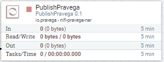
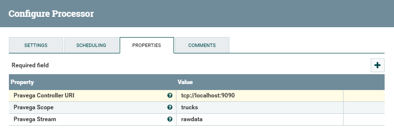
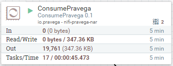
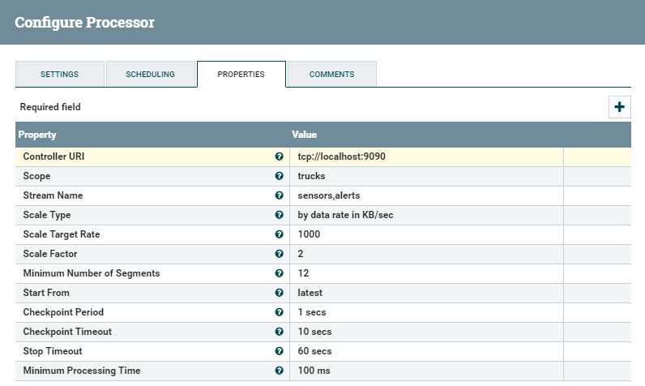

<!--
Copyright (c) Dell Inc., or its subsidiaries. All Rights Reserved.

Licensed under the Apache License, Version 2.0 (the "License");
you may not use this file except in compliance with the License.
You may obtain a copy of the License at

    http://www.apache.org/licenses/LICENSE-2.0
-->
# Pravega Connectors for Apache NiFi

Connectors to read and write [Pravega](http://pravega.io/) streams with [Apache NiFi](https://nifi.apache.org/).










## Processors

  - **PublishPravega**: This processor writes incoming FlowFiles to a Pravega stream.
    It uses Pravega transactions to provide at-least-one guarantees.
    
  - **PublishPravegaRecord**: This is similar to PublishPravega but it uses a NiFi Record Reader to parse the incoming
    FlowFiles as CSV, JSON, or Avro. Each record will be written as a separate event to a Pravega stream.
    Events written to Pravega will be serialized with a Record Writer and can be CSV, JSON, or Avro.

  - **ConsumePravega**: This processor reads events from a Pravega stream and produces FlowFiles.
    This processor stores the most recent successful Pravega checkpoint in the NiFi cluster state
    to allow it to resume when restarting the processor or node.
    It provides at-least-once guarantees.

All of these processors allow for concurrency in a NiFi cluster or a standalone NiFi node.


## Building

```
mvn install
```

## Adding to NiFi

Copy the produced artifact `nifi-pravega-nar/target/nifi-pravega-nar-0.1.nar` to the `lib` directory of your NiFi home directory. 
Then restart Apache NiFi.
